# PlantUML examples

[PlantUML](http://plantuml.com) is a software tool that uses text formatting to create graphic diagrams. This page introduces PlantUML by showing examples with diagrams and source code, for UML, ERD, wireframes, mind maps, JSON, YAML, WBS, ASCII art, Gantt charts, C4 models, and more. 


## Sequence diagram

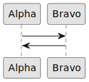
<details>
 <summary>Diagram 1 plantuml</summary>

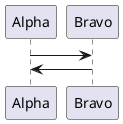
</details>

## Sequence diagram with steps and divider

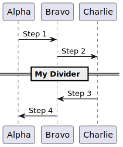
<details>
 <summary>Diagram 2 plantuml</summary>

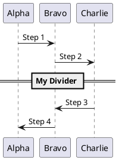
</details>


## Sequence diagram with participant shapes

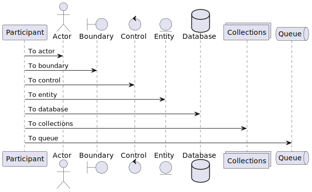
<details>
 <summary>Diagram 3 plantuml</summary>

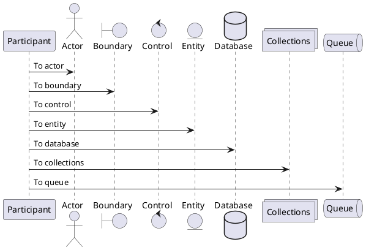
</details>


## Usecase diagram

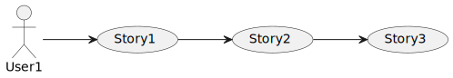
<details>
 <summary>Diagram 4 plantuml</summary>

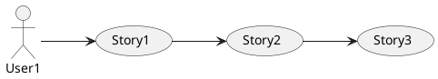
</details>

## Object diagram

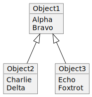
<details>
 <summary>Diagram 5 plantuml</summary>

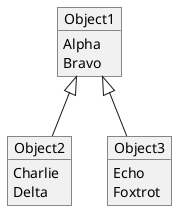
</details>

## Class diagram

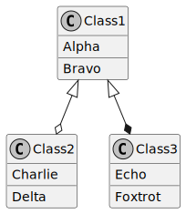
<details>
 <summary>Diagram 6 plantuml</summary>

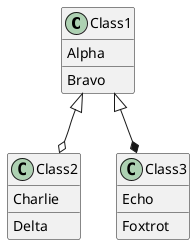
</details>

## Entity relationship diagram (ERD)

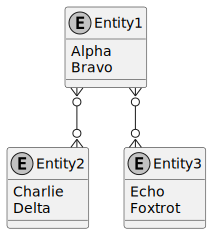
<details>
 <summary>Diagram 7 plantuml</summary>

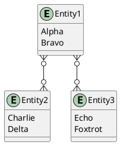
</details>

## Package styles

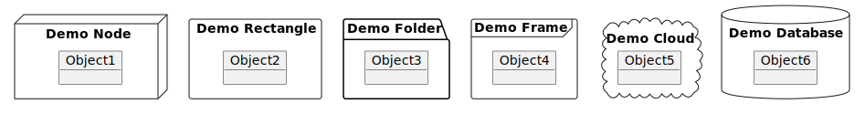
<details>
 <summary>Diagram 8 plantuml</summary>

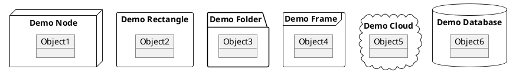
</details>

## Activity diagram

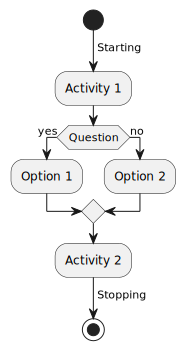
<details>
 <summary>Diagram 9 plantuml</summary>

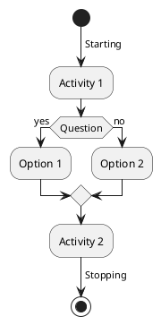
</details>

## Component diagram of items

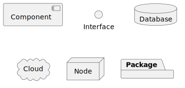
<details>
 <summary>Diagram 10 plantuml</summary>

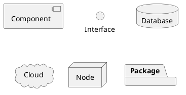
</details>

## State diagram

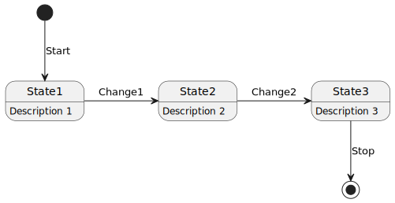
<details>
 <summary>Diagram 11 plantuml</summary>

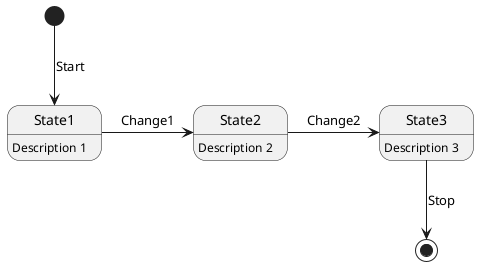
</details>

## Deployment diagram items

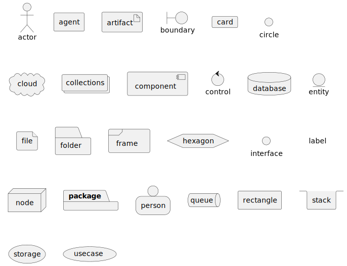
<details>
 <summary>Diagram 12 plantuml</summary>

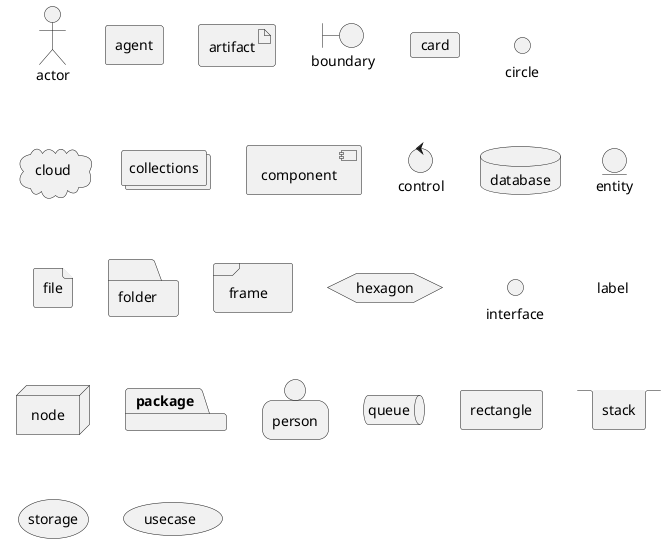
</details>

## Timing diagram

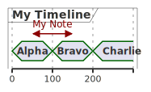
<details>
 <summary>Diagram 13 plantuml</summary>

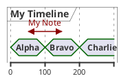
</details>

## Diagrams through ASCII art (DITAA)


<details>
<summary>View Source</summary>
<pre>
@startditaa
+--------+   +-------+    +-------+
|        +---+ ditaa +--> |       |
|  Text  |   +-------+    |diagram|
|Document|   |!magic!|    |       |
|     {d}|   |       |    |       |
+---+----+   +-------+    +-------+
    :                         ^
    |       Lots of work      |
    +-------------------------+
@endditaa
</pre>
</details>

## Wireframe

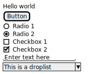
<details>
 <summary>Diagram 14 plantuml</summary>

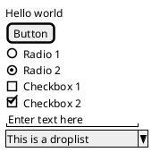
</details>

## Gantt chart


<details>
<summary>View Source</summary>
<pre>
@startgantt
skinparam monochrome true
[Task1] on {Alice} lasts 8 days
then [Task2] on {Bob} lasts 4 days at 50%
then [Task3] on {Carol} lasts 2 days at 25%
@endgantt
</pre>
</details>

## Mind map


<details>
<summary>View Source</summary>
<pre>
@startmindmap
+ C
++ D
++ E
-- A
-- B
@endmindmap
</pre>
</details>


## JSON data


<details>
<summary>View Source</summary>
<pre>
@startjson
{
   "fruit":"Apple",
   "size":"Large",
   "color": ["Red", "Green"]
}
@endjson
</pre>
</details>


## YAML data


<details>
<summary>View Source</summary>
<pre>
@startyaml
fruit: Apple
size: Large
color: 
  - Red
  - Green
@endyaml
</pre>
</details>


## Network diagram


<details>
 <summary>Diagram 15 plantuml</summary>

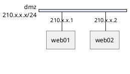
</details>

## Work breakdown structure (WBS)


<details>
<summary>View Source</summary>
<pre>
@startwbs
* Top
** A
*** A1
*** A2
** B
*** B1
*** B2
@endwbs
</pre>
</details>

## OpenIconic

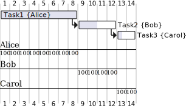
<details>
 <summary>Diagram 16 plantuml</summary>

```plantuml
@startuml
title: <&heart> Demo <&heart>
@enduml
```
</details>
</pre>
</details>

OpenIconic provides open source icons. OpenIconic is now built-in to PlantUML.

## Font Awesome

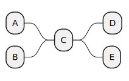
<details>
 <summary>Diagram 17 plantuml</summary>


</details>

## Procedure

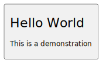
<details>
 <summary>Diagram 18 plantuml</summary>

```plantuml
@startuml

!procedure $demo($name, $headline, $description)
  card $name as "\n<size:22>$headline</size>\n\n<size:12>$description</size>\n"
!endprocedure

$demo(MyCard, "Hello World", "This is a demonstration")

@enduml
```
</details>

## Procedure layout


<details>
 <summary>Diagram 19 plantuml</summary>

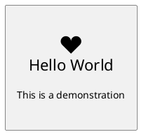
</details>

This shows how to create your own procedure to create a custom layout with a shape, object name, OpenIconic icon, headline that uses big size text, and a description that uses normal size text.

## Area diagram

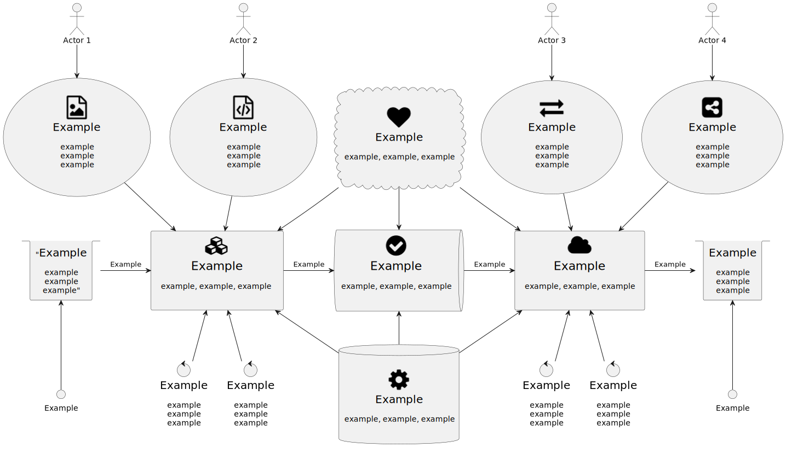
<details>
 <summary>Diagram 20 plantuml</summary>

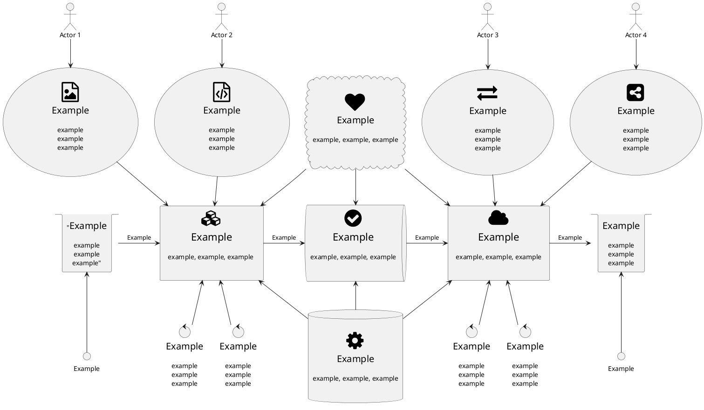
</details>

The area diagram is an example deployment diagram that shows a bunch of areas and how they interrlate. This example is useful for seeing a real-world diagram, that uses boxes, arrows, Font Awesome icons, multi-line text, Unicode padding, font sizes, and more.

## C4 model

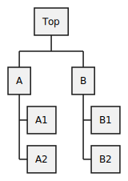
<details>
 <summary>Diagram 21 plantuml</summary>

```plantuml
@startuml
!include <C4/C4_Container>

Person(personAlias, "Label", "Optional Description")
Container(containerAlias, "Label", "Technology", "Optional Description")
System(systemAlias, "Label", "Optional Description")

System_Ext(extSystemAlias, "Label", "Optional Description")

Rel(personAlias, containerAlias, "Label", "Optional Technology")

Rel_U(systemAlias, extSystemAlias, "Label", "Optional Technology")
@enduml
```
</details>

[C4 Model](https://c4model.com/) focuses diagrams on four areas: Context, Containers, Components, Code.

## Standard library


<details>
 <summary>Diagram 22 plantuml</summary>

```plantuml
@startuml
stdlib
@enduml
```
</details>

You can list standard library folders by using the special diagram "stdlib".

## OpenIconic list


<details>
 <summary>Diagram 23 plantuml</summary>

```plantuml
@startuml
listopeniconic
@enduml
```
</details>

You can list all the OpenIconic icon names and images by using the special diagram "listopeniconic".
