# PlantUML demo

PlantUML is a tool that uses text formatting to create graphic diagrams.

http://plantuml.com/class-diagram


## Sequence diagram

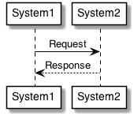

```plantuml
@startuml
!include styles.txt
System1 -> System2: Request
System2 --> System1: Response
@enduml
```


## Usecase diagram

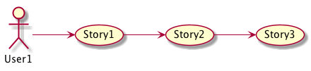

```plantuml
@startuml
!include styles.txt
left to right direction
User1 --> (Story1)
(Story1) --> (Story2)
(Story2) --> (Story3)
@enduml
```


## Object diagram

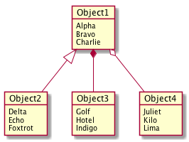

```plantuml
@startuml
!include styles.txt
object Object1 {
  Alpha
  Bravo
  Charlie
}
object Object2 {
  Delta
  Echo
  Foxtrot
}
object Object3 {
  Golf
  Hotel
  Indigo
}
object Object4 {
  Juliet
  Kilo
  Lima
}
Object1 <|-- Object2
Object1 *-- Object3
Object1 o-- Object4
@enduml
```

## Class diagram

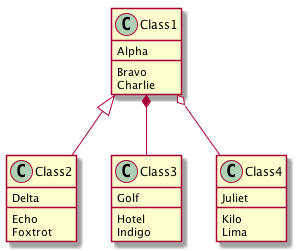

```plantuml
@startuml
!include styles.txt
class Class1 {
  {field} Alpha
  {method} Bravo
  {method} Charlie
}
class Class2 {
  {field} Delta
  {method} Echo
  {method} Foxtrot
}
class Class3 {
  {field} Golf
  {method} Hotel
  {method} Indigo
}
class Class4 {
  {field} Juliet
  {method} Kilo
  {method} Lima
}
Class1 <|-- Class2
Class1 *-- Class3
Class1 o-- Class4
@enduml
```

## Activity diagram


```plantuml
@startuml
!include styles.txt
start
-> Starting;
:Activity 1;
if (Question) then (yes)
  :Option 1;
else (no)
  :Option 2;
endif
:Activity 2;
-> Stopping;
stop
@enduml
```


## Component diagram

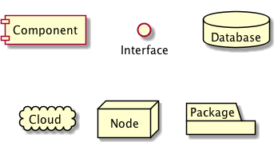

```plantuml
@startuml
!include styles.txt
component "Component"
interface "Interface"
database "Database"
cloud "Cloud"
node "Node"
package "Package"
@enduml
```


## State diagram

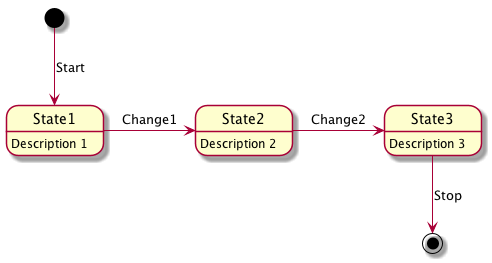

```plantuml
@startuml
!include styles.txt
[*] --> State1 : Start
State1 -> State2 : Change1
State2 -> State3 : Change2
State3 --> [*] : Stop
State1 : Description 1
State2 : Description 2
State3 : Description 3
@enduml
```


## Deployment diagram

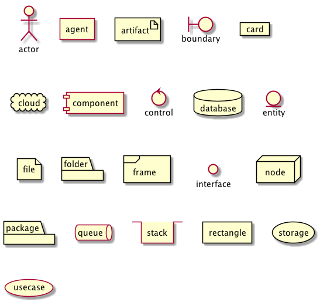

```plantuml
@startuml
!include styles.txt
actor actor
agent agent
artifact artifact
boundary boundary
card card
cloud cloud
component component
control control
database database
entity entity
file file
folder folder
frame frame
interface  interface
node node
package package
queue queue
stack stack
rectangle rectangle
storage storage
usecase usecase
@enduml
```


## Timing diagram

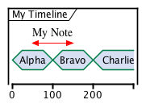

```plantuml
@startuml
!include styles.txt
concise "My Timeline" as T
@T
0 is Alpha
+100 is Bravo
+100 is Charlie
@50 <-> @+100 : My Note
@enduml
```


## Wireframe

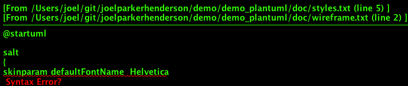

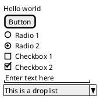


## Gantt chart

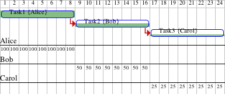

```plantuml
@startgantt
[Task1] on {Alice} lasts 8 days
then [Task2] on {Bob} lasts 4 days at 50% 
then [Task3] on {Carol} lasts 2 days at 25%
@endgantt
```
