# PlantUML demo

PlantUML is a tool that uses text formatting to create graphic diagrams. See http://plantuml.com

Contents:

- [PlantUML demo](#plantuml-demo)
  - [Sequence diagram demo](#sequence-diagram-demo)
  - [Sequence diagram demo with steps and divider](#sequence-diagram-demo-with-steps-and-divider)
  - [Usecase diagram demo](#usecase-diagram-demo)
  - [Object diagram demo](#object-diagram-demo)
  - [Class diagram demo](#class-diagram-demo)
  - [Package styles](#package-styles)
  - [Activity diagram demo](#activity-diagram-demo)
  - [Component diagram demo of items](#component-diagram-demo-of-items)
  - [State diagram demo](#state-diagram-demo)
  - [Deployment diagram demo of items](#deployment-diagram-demo-of-items)
  - [Timing diagram demo](#timing-diagram-demo)
  - [Wireframe demo](#wireframe-demo)
  - [Gantt chart demo](#gantt-chart-demo)
  - [Font Awesome demo](#font-awesome-demo)
  - [Procedure demo](#procedure-demo)
  - [Area diagram demo](#area-diagram-demo)


## Sequence diagram demo

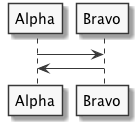

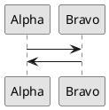


## Sequence diagram demo with steps and divider

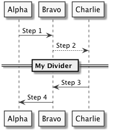

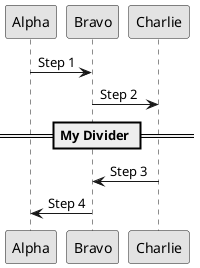

## Usecase diagram demo


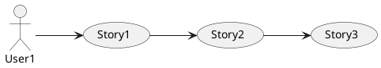


## Object diagram demo

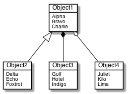

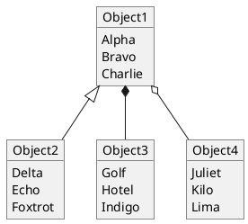

## Class diagram demo

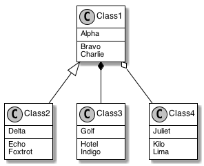

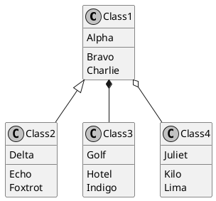

## Package styles

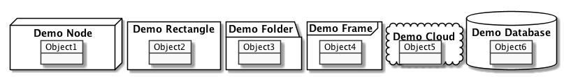

```
@startuml
package "Demo Node" <<Node>> {
  object Object1
}
package "Demo Rectangle" <<Rectangle>> {
  object Object2
}
package "Demo Folder" <<Folder>> {
  object Object3
}
package "Demo Frame" <<Frame>> {
  object Object4
}
package "Demo Cloud" <<Cloud>> {
  object Object5
}
package "Demo Database" <<Database>> {
  object Object6
}
@enduml
```


## Activity diagram demo

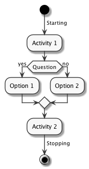

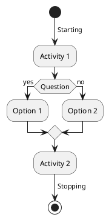


## Component diagram demo of items


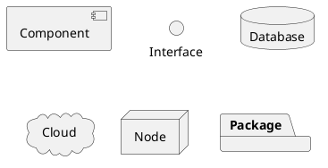


## State diagram demo

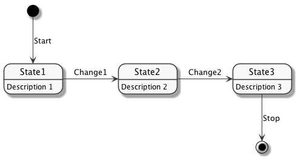

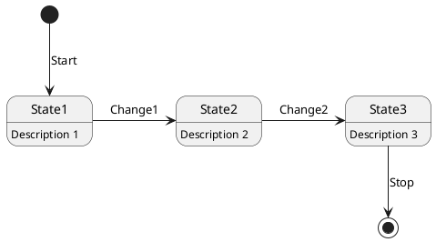


## Deployment diagram demo of items

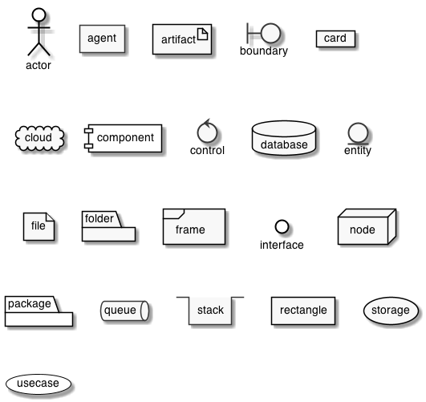

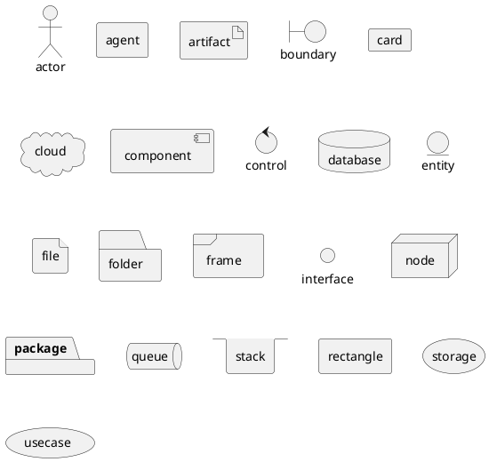


## Timing diagram demo


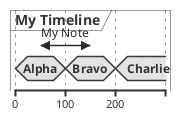


## Wireframe demo

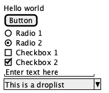

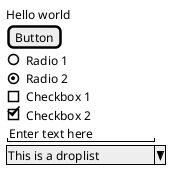


## Gantt chart demo


```plantuml
@startgantt
skinparam monochrome true
[Task1] on {Alice} lasts 8 days
then [Task2] on {Bob} lasts 4 days at 50%
then [Task3] on {Carol} lasts 2 days at 25%
@endgantt
```

## Font Awesome demo


```plantuml
@startuml
skinparam monochrome true
!include <font-awesome/star>
rectangle "<$star>"
@enduml
```


## Procedure demo


```plantuml
@startuml

!procedure $demo($name, $headline, $description)
  card $name as "\n<size:22>$headline</size>\n\n<size:12>$description</size>\n"
!endprocedure

$demo(MyCard, "Hello World", "This is a demonstration")

@enduml
```


## Area diagram demo

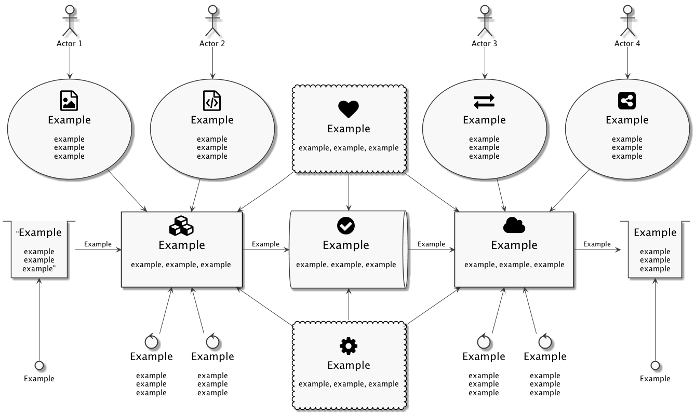

[Area diagram PlantUML](doc/area_diagram/area_diagram.txt)

The area diagram is an example deployment diagram that shows a bunch of areas and how they interrlate. This example is useful for seeing a real-world diagram, that uses boxes, arrows, Font Awesome icons, multi-line text, Unicode padding, font sizes, and more.
