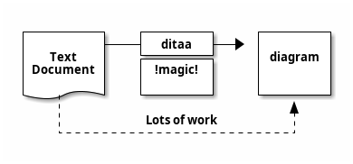
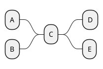
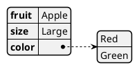

# PlantUML examples

[PlantUML](http://plantuml.com) is a software tool that uses text formatting to create graphic diagrams. This page introduces PlantUML by showing examples with diagrams and source code, for UML, ERD, wireframes, mind maps, JSON, YAML, WBS, ASCII art, Gantt charts, C4 models, and more. 


## Sequence diagram


<details>
 <summary>View Source of Diagram 1</summary>


</details>

## Sequence diagram with steps and divider


<details>
 <summary>View Source of Diagram 2</summary>


</details>


## Sequence diagram with participant shapes


<details>
 <summary>View Source of Diagram 3</summary>


</details>


## Usecase diagram


<details>
 <summary>View Source of Diagram 4</summary>


</details>

## Object diagram


<details>
 <summary>View Source of Diagram 5</summary>


</details>

## Class diagram


<details>
 <summary>View Source of Diagram 6</summary>


</details>

## Entity relationship diagram (ERD)


<details>
 <summary>View Source of Diagram 7</summary>


</details>

## Package styles


<details>
 <summary>View Source of Diagram 8</summary>


</details>

## Activity diagram


<details>
 <summary>View Source of Diagram 9</summary>


</details>

## Component diagram of items


<details>
 <summary>View Source of Diagram 10</summary>


</details>

## State diagram


<details>
 <summary>View Source of Diagram 11</summary>


</details>

## Deployment diagram items


<details>
 <summary>View Source of Diagram 12</summary>


</details>

## Timing diagram


<details>
 <summary>View Source of Diagram 13</summary>


</details>

## Diagrams through ASCII art (DITAA)


<details>
 <summary>View Source of Diagram 14</summary>


</details>

## Wireframe


<details>
 <summary>View Source of Diagram 15</summary>


</details>

## Gantt chart


<details>
 <summary>View Source of Diagram 16</summary>

```plantuml
@startgantt
skinparam monochrome true
[Task1] on {Alice} lasts 8 days
then [Task2] on {Bob} lasts 4 days at 50%
then [Task3] on {Carol} lasts 2 days at 25%
@endgantt
```
</details>

## Mind map


<details>
 <summary>View Source of Diagram 17</summary>


</details>

## JSON data


<details>
 <summary>View Source of Diagram 18</summary>


</details>

## YAML data


<details>
 <summary>View Source of Diagram 19</summary>


</details>

## Network diagram


<details>
 <summary>View Source of Diagram 20</summary>


</details>

## Work breakdown structure (WBS)


<details>
 <summary>View Source of Diagram 21</summary>

```plantuml
@startwbs
* Top
** A
*** A1
*** A2
** B
*** B1
*** B2
@endwbs
```
</details>

## OpenIconic


<details>
 <summary>View Source of Diagram 22</summary>

```plantuml
@startuml
title: <&heart> Demo <&heart>
@enduml
```
</details>
</pre>
</details>

OpenIconic provides open source icons. OpenIconic is now built-in to PlantUML.

## Font Awesome


<details>
 <summary>View Source of Diagram 23</summary>

```plantuml
@startuml
skinparam monochrome true
!include <tupadr3/font-awesome/star>
rectangle "<$star>"
@enduml
```
</details>

## Procedure


<details>
 <summary>View Source of Diagram 24</summary>

```plantuml
@startuml
!procedure $demo($name, $headline, $description)
  card $name as "\n<size:22>$headline</size>\n\n<size:12>$description</size>\n"
!endprocedure

$demo(MyCard, "Hello World", "This is a demonstration")
@enduml
```
</details>

## Procedure layout


<details>
 <summary>View Source of Diagram 25</summary>

```plantuml
@startuml
skinparam defaultTextAlignment center

!procedure $layout($shape, $name, $openiconic, $headline, $description)
  $shape $name as "\n\n<size:44><&$openiconic></size>\n<size:22><U+00A0><U+00A0>$headline<U+00A0><U+00A0></size>\n\n<U+00A0><U+00A0>$description<U+00A0><U+00A0>\n\n"
!endprocedure

$layout(card, MyCard, heart, "Hello World", "This is a demonstration")
@enduml
```
</details>

This shows how to create your own procedure to create a custom layout with a shape, object name, OpenIconic icon, headline that uses big size text, and a description that uses normal size text.

## Area diagram


<details>
 <summary>View Source of Diagram 26</summary>

```plantuml
@startuml
skinparam defaultTextAlignment center

' icons
!include <tupadr3/font-awesome/check_circle>
!include <tupadr3/font-awesome/cloud>
!include <tupadr3/font-awesome/cubes>
!include <tupadr3/font-awesome/exchange>
!include <tupadr3/font-awesome/file_code_o>
!include <tupadr3/font-awesome/file_image_o>
!include <tupadr3/font-awesome/gavel>
!include <tupadr3/font-awesome/gear>
!include <tupadr3/font-awesome/globe>
!include <tupadr3/font-awesome/heart>
!include <tupadr3/font-awesome/share_alt_square>

' Pipeline objects
stack ""<size:20>Example</size>\n\nexample\nexample\nexample"" as StackLeft
card "<$cubes>\n<size:22><U+00A0><U+00A0>Example<U+00A0><U+00A0></size>\n\n<U+00A0><U+00A0>example, example, example <U+00A0><U+00A0>\n\n" as Pipeline1
queue "<$check_circle>\n<size:22><U+00A0><U+00A0>Example<U+00A0><U+00A0></size>\n\n<U+00A0><U+00A0>example, example, example<U+00A0><U+00A0>\n\n" as Pipeline2
card "<$cloud>\n<size:22><U+00A0><U+00A0>Example<U+00A0><U+00A0></size>\n\n<U+00A0><U+00A0>example, example, example<U+00A0><U+00A0>\n\n" as Pipeline3
stack "<size:20>Example</size>\n\nexample\nexample\nexample" as StackRight

' Pipeline flow
StackLeft -r-> Pipeline1 : "Example"
Pipeline1 -r-> Pipeline2 : "Example"
Pipeline2 -r-> Pipeline3 : "Example"
Pipeline3 -r-> StackRight : "Example"

' Left side
interface "Example" as InterfaceLeft
InterfaceLeft -u-> StackLeft

' Right side
interface "Example" as InterfaceRight
InterfaceRight -u-> StackRight

' Actor 1
actor "Actor 1" as Actor1
usecase "\n<$file_image_o>\n<size:20><U+00A0><U+00A0>Example<U+00A0><U+00A0></size>\n\nexample\nexample\nexample\n\n" as UseCase1
Actor1 -d-> UseCase1
UseCase1 -d-> Pipeline1

' Actor 2
actor "Actor 2" as Actor2
usecase "\n<$file_code_o>\n<size:20><U+00A0><U+00A0>Example<U+00A0><U+00A0></size>\n\nexample\nexample\nexample\n\n" as UseCase2
Actor2 -d-> UseCase2
UseCase2 -d-> Pipeline1

' Actor 3
actor "Actor 3" as Actor3
usecase "\n<$exchange>\n<size:20>Example</size>\n\nexample\nexample\nexample\n\n" as UseCase3
Actor3 -d-> UseCase3
UseCase3 -d-> Pipeline3

' Actor 4
actor "Actor 4" as Actor4
usecase "\n<$share_alt_square>\n<size:20>Example</size>\n\nexample\nexample\nexample\n\n" as UseCase4
Actor4 -d-> UseCase4
UseCase4 -d-> Pipeline3

' Diamond upper area
cloud "\n<$heart>\n<size:20>Example</size>\n\nexample, example, example\n\n" as DiamondUpper
DiamondUpper -d-> Pipeline1
DiamondUpper -d-> Pipeline2
DiamondUpper -d-> Pipeline3

' Diamond lower area
database "\n<$gear>\n<size:20>Example</size>\n\nexample, example, example\n\n" as DiamondLower
DiamondLower -u-> Pipeline1
DiamondLower -u-> Pipeline2
DiamondLower -u-> Pipeline3

' Hinting
UseCase1 -[hidden]r- UseCase2
UseCase2 -[hidden]r- DiamondUpper
DiamondUpper -[hidden]r- UseCase3
UseCase3 -[hidden]r- UseCase4

' Pipeline 1 controls
control "<size:20>Example</size>\n\nexample\nexample\nexample" as Pipeline1Control1 
control "<size:20>Example</size>\n\nexample\nexample\nexample" as Pipeline1Control2
Pipeline1Control1 -u-> Pipeline1
Pipeline1Control2 -u-> Pipeline1

' Pipeline 3 controls
control "<size:20>Example</size>\n\nexample\nexample\nexample" as Pipeline3Control1
control "<size:20>Example</size>\n\nexample\nexample\nexample" as Pipeline3Control2
Pipeline3Control1 -u-> Pipeline3
Pipeline3Control2 -u-> Pipeline3
@enduml
```
</details>

The area diagram is an example deployment diagram that shows a bunch of areas and how they interrlate. This example is useful for seeing a real-world diagram, that uses boxes, arrows, Font Awesome icons, multi-line text, Unicode padding, font sizes, and more.

## C4 model


<details>
 <summary>View Source of Diagram 27</summary>

```plantuml
@startuml
!include <C4/C4_Container>

Person(personAlias, "Label", "Optional Description")
Container(containerAlias, "Label", "Technology", "Optional Description")
System(systemAlias, "Label", "Optional Description")

System_Ext(extSystemAlias, "Label", "Optional Description")

Rel(personAlias, containerAlias, "Label", "Optional Technology")

Rel_U(systemAlias, extSystemAlias, "Label", "Optional Technology")
@enduml
```
</details>

[C4 Model](https://c4model.com/) focuses diagrams on four areas: Context, Containers, Components, Code.

## Standard library


<details>
 <summary>View Source of Diagram 28</summary>

```plantuml
@startuml
stdlib
@enduml
```
</details>

You can list standard library folders by using the special diagram "stdlib".

## OpenIconic list


<details>
 <summary>View Source of Diagram 29</summary>

```plantuml
@startuml
listopeniconic
@enduml
```
</details>

You can list all the OpenIconic icon names and images by using the special diagram "listopeniconic".
