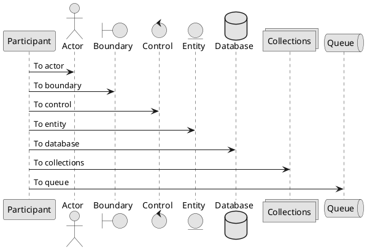
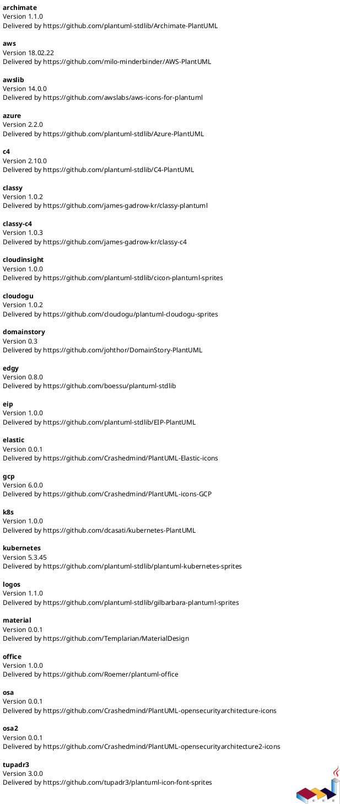

# PlantUML demo

PlantUML is a tool that uses text formatting to create graphic diagrams. See http://plantuml.com

Contents:

- [Sequence diagram demo](#sequence-diagram-demo)
- [Sequence diagram demo with steps and divider](#sequence-diagram-demo-with-steps-and-divider)
- [Sequence diagram demo with participant shapes](#sequence-diagram-demo-with-participant-shapes)
- [Usecase diagram demo](#usecase-diagram-demo)
- [Object diagram demo](#object-diagram-demo)
- [Class diagram demo](#class-diagram-demo)
- [Package styles](#package-styles)
- [Activity diagram demo](#activity-diagram-demo)
- [Component diagram demo of items](#component-diagram-demo-of-items)
- [State diagram demo](#state-diagram-demo)
- [Deployment diagram demo of items](#deployment-diagram-demo-of-items)
- [Timing diagram demo](#timing-diagram-demo)
- [Wireframe demo](#wireframe-demo)
- [Gantt chart demo](#gantt-chart-demo)
- [OpenIconic demo](#openiconic-demo)
- [Font Awesome demo](#font-awesome-demo)
- [Procedure demo](#procedure-demo)
- [Procedure layout demo](#procedure-layout-demo)
- [Area diagram demo](#area-diagram-demo)
- [Standard library demo](#standard-library-demo)


## Sequence diagram demo


## Sequence diagram demo with steps and divider


## Sequence diagram demo with participant shapes




## Usecase diagram demo


## Object diagram demo


## Class diagram demo


## Package styles


```
@startuml
package "Demo Node" <<Node>> {
  object Object1
}
package "Demo Rectangle" <<Rectangle>> {
  object Object2
}
package "Demo Folder" <<Folder>> {
  object Object3
}
package "Demo Frame" <<Frame>> {
  object Object4
}
package "Demo Cloud" <<Cloud>> {
  object Object5
}
package "Demo Database" <<Database>> {
  object Object6
}
@enduml
```


## Activity diagram demo


## Component diagram demo of items


## State diagram demo


## Deployment diagram demo of items


## Timing diagram demo


## Wireframe demo


## Gantt chart demo


```plantuml
@startgantt
skinparam monochrome true
[Task1] on {Alice} lasts 8 days
then [Task2] on {Bob} lasts 4 days at 50%
then [Task3] on {Carol} lasts 2 days at 25%
@endgantt
```


## OpenIconic demo


OpenIconic provides open source icons. OpenIconic is now built-in to PlantUML.


## Font Awesome demo


```plantuml
@startuml
skinparam monochrome true
!include <font-awesome/star>
rectangle "<$star>"
@enduml
```


## Procedure demo


## Procedure layout demo


This demo shows how to create your own procedure to create a custom layout with a shape, object name, OpenIconic icon, headline that uses big size text, and a description that uses normal size text.


## Area diagram demo


[Area diagram PlantUML](doc/area_diagram/area_diagram.txt)

The area diagram is an example deployment diagram that shows a bunch of areas and how they interrlate. This example is useful for seeing a real-world diagram, that uses boxes, arrows, Font Awesome icons, multi-line text, Unicode padding, font sizes, and more.


## Standard library demo




You can list standard library folders by using the special diagram "stdlib".
